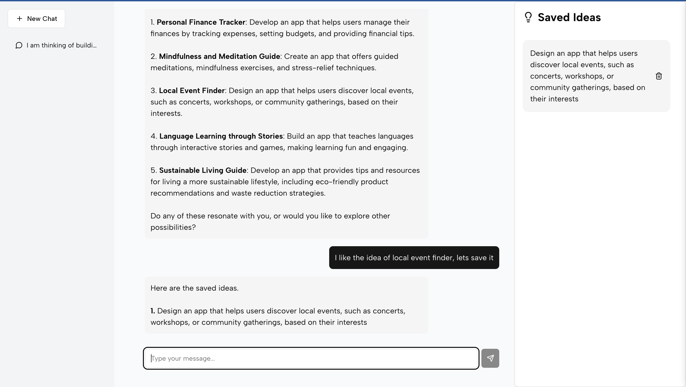

# Brainstorm Chatbot Application

## Description

A full-stack web application that allows users to brainstorm with a chatbot to generate ideas and save selected ideas in a list.

## Installation

1. **Clone the repository:**

    ```bash
    git clone https://github.com/onecuriousmindset/brainstorm-ideas-using-ai.git
    ```

2. **Navigate to the project directory:**

    ```bash
    cd brainstorm-ideas-using-ai
    ```
    
3. **Install dependencies:**
    ```bash
    npm install
    ```

4. **Set up environment variables:**
    - Create `.env` files in server and client directory.
    - Copy the `.env.example` files to create the actual `.env` files


    ```bash
     cp server/.env.example server/.env
     cp client/.env.example client/.env
    ```

    - Fill in the required variables in both `server/.env` and `client/.env`.

5. **Start the application:**

    ```bash
    npm run start
    ```

6. **Access the application:**
    - Open your browser and go to `http://localhost:3000`.

## Usage

-   **Chat with the Bot:**
    -   Type your messages in the input field and press Enter or click the send button.
-   **Save an Idea:**
    -   Simply tell the bot to save an idea naturally (e.g., "Save this idea" or "Save all the ideas we have discussed", etc).
-   **Delete an Idea**
    -   Click the "Trash" Icon on the Idea Card
-   **Start a New Chat:**
    -   Click the "New Chat" button


## Screenshots



## Features

-   **Chat Interface:** Engage in conversations with the chatbot to brainstorm ideas.
-   **Saved Ideas List:** Automatically saves ideas upon user command.
-   **Reset Functionality:** Easily start a new chat.
-   **Responsive Design:** Optimized for desktop, tablet, and mobile devices.

## Technologies Used

-   **Front-End:** Next.js, TailwindCSS and ShadCN
-   **Back-End:** Node.js, Express, TypeScript, OPEN AI's gpt-4o model

## API Documentation

This project uses **Swagger** for interactive API documentation. After starting the server, you can access the Swagger UI at:

- **URL:** `http://localhost:3001/api-docs`

## API Endpoints

-   **POST /api/v1/ai/chat**

    -   **Description:** Send a message to the chatbot.

    -   **Request Body:**
        ```javascript
        {
          "messages": [
            {
              "role": "user",  // "user" or "assistant"
              "content": [
                {
                  "type": "text",
                  "text": "string"
                }
              ]
            }
          ]
        }
        ```
    -   **Response:**
        ```javascript
        {
            "response": "Chatbot's reply"
        }
        ```